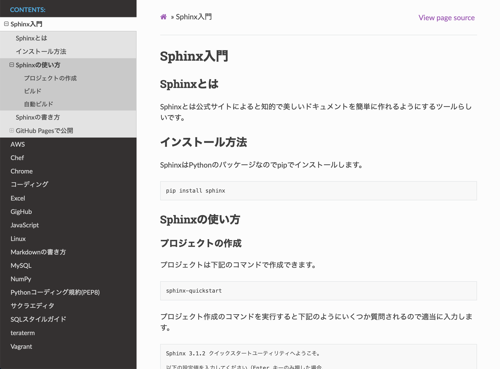
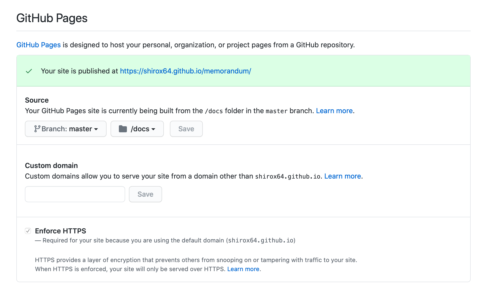

============
Sphinx入門
============

Sphinxとは
------------
Sphinxとは公式サイトによると知的で美しいドキュメントを簡単に作れるようにするツールらしいです。
デフォルトはreStructuredTextという軽量マークアップ言語でドキュメントを書きますが、Markdown用のライブラリをインストールすることでMarkdownも利用できるようになります。
下のキャプチャは実際にSphinxで作成したドキュメントになります。

インストール方法
----------------
SphinxはPythonのパッケージなのでpipでインストールします。 ::

  pip install sphinx

Sphinxの使い方
----------------
プロジェクトの作成
^^^^^^^^^^^^^^^^^^
プロジェクトは下記のコマンドで作成できます。 ::

  sphinx-quickstart

プロジェクト作成のコマンドを実行すると下記のようにいくつか質問されるので適当に入力します。 ::

  Sphinx 3.1.2 クイックスタートユーティリティへようこそ。

  以下の設定値を入力してください（Enter キーのみ押した場合、
  かっこで囲まれた値をデフォルト値として受け入れます）。

  選択されたルートパス: .

  Sphinx 出力用のビルドディレクトリを配置する方法は2つあります。
  ルートパス内にある "_build" ディレクトリを使うか、
  ルートパス内に "source" と "build" ディレクトリを分ける方法です。
  > ソースディレクトリとビルドディレクトリを分ける（y / n） [n]: y

  プロジェクト名は、ビルドされたドキュメントのいくつかの場所にあります。
  > プロジェクト名: memorandum
  > 著者名（複数可）: shirox64
  > プロジェクトのリリース []: 1.0.0

  ドキュメントを英語以外の言語で書く場合は、
  言語コードで言語を選択できます。Sphinx は生成したテキストをその言語に翻訳します。

  サポートされているコードのリストについては、
  https://www.sphinx-doc.org/en/master/usage/configuration.html#confval-language を参照してください。
  > プロジェクトの言語 [en]: ja

プロジェクトは下記のような構造で作成されます。ドキュメントはsourceディレクトリ内で作成します。 ::

  .
  ├── Makefile
  ├── build
  ├── make.bat
  └── source
      ├── _static
      ├── _templates
      ├── conf.py
      └── index.rst

ビルド
^^^^^^^
下記のコマンドでビルドが実行されます。ビルドした結果はbuildディレクトリ内に出力されます。 ::

  make html

自動ビルド
^^^^^^^^^^
編集する度にビルドして確認するのは効率が悪いので自動的にビルドしてくれるsphinx-autobuildを利用します。
sphinx-autobuildのインストールコマンドは下記になります。 ::

  pip install sphinx-autobuild

下記のコマンドで自動的にビルトとブラウザの再リロードをしてくれるようになります。 ::

  sphinx-autobuild -b html source build/html

コマンド実行後、http://127.0.0.1:8000 にアクセスするとビルドした結果を確認できます。

Sphinxのテーマ
----------------
| Sphinxのテーマは豊富にあります。下記のサイトから好きなデザインを見つけて作成できます。
| https://sphinx-themes.org

Sphinxの書き方(reStructuredText)
--------------------------------------
パラグラフ(段落)
^^^^^^^^^^^^^^^^^^^
1つ以上の空行が段落の区切りになります。 ::

  パラグラフ1
  パラグラフ1

  パラグラフ2

  パラグラフ3

改行
^^^^^^
同じパラグラフ内は改行されないので改行したい場合は先頭を|にします。 ::

  | 1行目
  | 2行目
  | 3行目

見出し
^^^^^^^^^^^^
区切り文字(#*=-^")のどれかを下に並べると見出しになります。
同一ファイルの先頭の見出しの区切り文字から順に見出しレベルが割り振られます。
先頭の見出しの区切り文字がh1、次の区切り文字がh2、h3以降も順に割り振れます。
しかし、Pythonのドキュメントの書き方は、下記の例の順を推奨しています。
また、見出しの文字数より区切り文字の数が短いとビルド時に警告が出るので注意が必要です。::

  ############
  見出し(h1)
  ############

  ************
  見出しh2
  ************

  見出しh3
  ============

  見出しh4
  ------------

  見出しh5
  ^^^^^^^^^^^^

  見出しh6
  """"""""""""

順序なしリスト
^^^^^^^^^^^^^^
順序なしリストは*を使います。入れ子にする場合は、親子間で空行を挟みます。 ::

  * AAA
  * BBB

    * CCC
    * DDD

順序ありリスト
^^^^^^^^^^^^^^
順序ありリストは数字の後にドットです。 ::

  1. AAA
  2. BBB

    1. CCC
    2. DDD

コードブロック
^^^^^^^^^^^^^^
コードブロックはパラグラフの末尾または先頭を::にし、空行を挟んでコードを書きます。
::

  パラグラフ ::

    print('hello world')

  ::

    print('hello world')

画像
^^^^^^
::

  .. image:: 画像のURL

リンク
^^^^^^^
::

  `リンクのテキスト <リンク先URL>`_

強調
^^^^^^^
::

  *強調(イタリック)*
  **強い強調(太文字)**
  `コードサンプル`

GitHub Pagesで公開
--------------------
GitHubでGitHub Pagesの設定
^^^^^^^^^^^^^^^^^^^^^^^^^^^^^^^
GitHub Pagesの設定はGitHubの対象のリポジトリのページのSettingsタブを選択し、少し下にスクロールするとあります。
公開するソースのディレクトリはリポジトリ直下もしくはリポジトリ直下のdocsを選択できます。

.nojekyllファイルの作成
^^^^^^^^^^^^^^^^^^^^^^^^^^
GitHub PagesはJekyIIが使われており、_staticなどにあるファイルを読み取ることができないのでsphinxのcssが適用されません。
そこでリポジトリの直下に.nojekyllという空ファイルを配置する必要があります。

Sphinxのビルド
^^^^^^^^^^^^^^^^^^^^^^^^^
"make html"のコマンドは、デフォルトでbuildディレクトリに出力されるので下記のコマンドのように出力先を指定する必要があります。 ::

  sphinx-build -b html source docs/

ソースの公開
^^^^^^^^^^^^
ビルドが完了すれば、後はプッシュするだけです。

Markdown対応
-----------------
SphinxはreStructuredTextだけでなくMarkdownも利用できます。
Markdownを利用できるにするにはrecommonmarkをインストールする必要があります。 ::

  pip install recommonmark

インストール後、conf.pyを下記のように修正することでMarkdownが利用可能なります。 ::

  extensions = ['recommonmark']

  source_suffix = {
    '.rst': 'restructuredtext',
    '.txt': 'markdown',
    '.md': 'markdown',
  }
